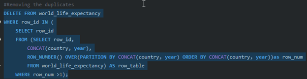
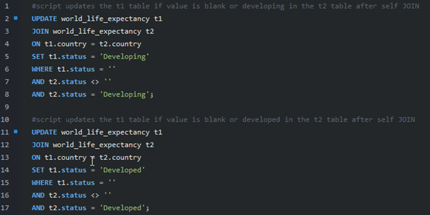
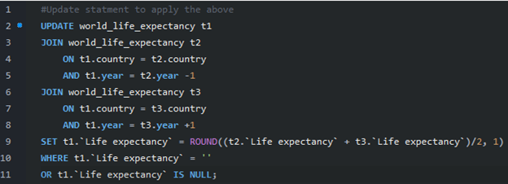

# Project 1: World Life Expectancy – Data Cleaning

## Project Overview
The goal of this project was to clean and prepare the **World Life Expectancy dataset** for analysis.  
The dataset contained several common data quality issues, including:
- Missing values in the `Status` and `Life Expectancy` columns
- Duplicate records

This project demonstrates data-cleaning techniques using **SQL**, focusing on **deduplication, null handling, and imputation strategies**.

---

## Data Quality Challenges & Solutions

### 1. Handling Duplicates
- A composite key (`Country + Year`) was created to identify duplicate records.  
- Duplicate rows were removed, ensuring each country-year combination was unique.  

  

<em>Figure 1. Identifying duplicate country-year records.</em>

---

### 2. Handling Missing Values in `Status`
- The `Status` column had null values (Developed vs. Developing).  
- A **self-join** was used to impute missing values based on the same country’s other records.  

  

<em>Figure 2. Filling missing Status values using a self-join strategy.</em>

---

### 3. Handling Missing Values in `Life Expectancy`
- Nulls in `Life Expectancy` were addressed by calculating averages from the **previous year and following year** using multiple self-joins.  
- Example: Missing values in **Afghanistan** and **Albania** were successfully imputed using this method.  

  

<em>Figure 3. Updating Life Expectancy with self-join imputation.</em>

---

## Results
- Removed duplicate records 
- Filled all missing `Status` values (Developed vs. Developing)  
- Imputed missing `Life Expectancy` values using temporal averages  
- Produced a clean dataset ready for further analysis and visualization  

---

## Skills & Tools Demonstrated
- **SQL**: Joins, self-joins, aggregation, and update queries  
- **Data Cleaning**: Deduplication, null handling, imputation strategies  
- **Data Quality Assurance**: Validating fields, ensuring dataset integrity  

---

## Next Steps
This cleaned dataset can now be used for:
- Exploratory data analysis  
- Statistical modeling  
- Building dashboards to visualize global life expectancy trends
